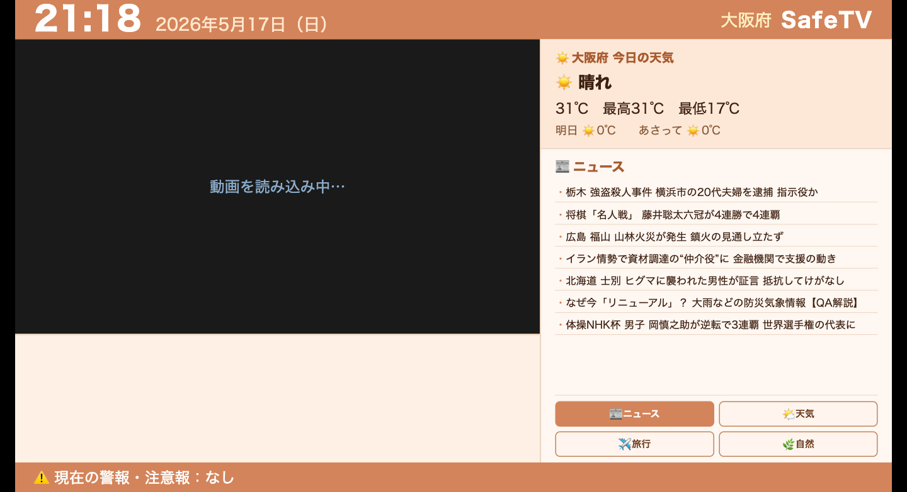
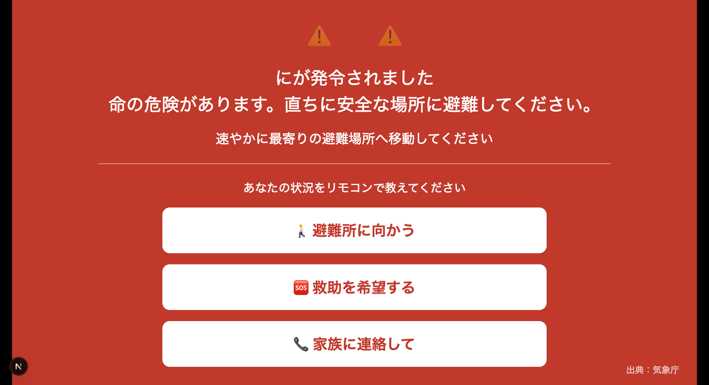

# MiruTV

**高齢者家庭向け、テレビで動く防災・生活情報ダッシュボード。**

台風や地震が発生したとき、このアプリを立ち上げれば避難情報の確認から家族・介護施設への連絡までをテレビ画面一枚でカバーすることを目指している。このデモはその第一歩として、テレビ型UIで防災情報を届けるコンセプトを実証したもの。

Android TV・Fire TV Stickのブラウザから開くだけで動く。アカウント登録・アプリのインストール不要。

**デモ**: https://mirutv.eggsystems.jp

---

## 背景

高齢者は災害時にもっとも情報から切り離されやすい。避難が遅れた理由として「情報が届かなかった」「操作がわからなかった」が繰り返し上位に挙がる。スマートフォンが普及しても、緊急時に慣れないアプリを開く操作は高齢者には現実的ではない。

一方でテレビは、ほぼすべての高齢者世帯にあり、毎日操作されている。Android TV・Fire TV Stickの普及により、WebアプリをそのままテレビのHDMIから配信することが現実的になった。この組み合わせで「テレビが防災情報端末になる」ことを目指している。

---

## スクリーンショット

| メイン画面 | 避難アラート |
|:---:|:---:|
|  |  |

---

## 現在のデモ機能

初回起動時に都道府県を選ぶだけで、以下がすべて自動で動く。

- **YouTube動画の連続再生** — ニュース・天気・旅行・自然の4カテゴリ。リモコン操作（前の動画・次の動画・消音）で切り替え
- **NHKニュース一覧** — NHKトピックスAPIから最新ニュースを7件ずつ30秒ごとに自動スクロール
- **天気予報** — 気象庁APIから選択中の都道府県の3日間天気・気温を表示
- **災害アラート自動割り込み** — 気象庁の防災情報APIを5分ごとに監視。警戒レベル3以上を検知すると動画もニュースも消えてアラート画面に全画面自動遷移。避難の種別・発令エリア・発令時刻を大きな文字で表示

---

## 目指している先（計画）

このデモで実証したテレビUI基盤の上に、以下の機能拡張を想定している。

| 機能 | 概要 |
|---|---|
| 家族への連絡 | 災害アラート画面からワンボタンで家族に通知 |
| 介護施設への連絡 | かかりつけ施設への安否報告をリモコン操作1回で完結 |
| 安否確認の自動送信 | 一定時間操作がない場合、家族に自動で安否確認を送信 |
| 避難所ナビ | 最寄りの避難所を画面表示 |
| Android TVアプリ化 | Kotlin WebViewでパッケージング。Webコンテンツ部分はそのまま流用 |

---

## 技術スタック

| レイヤー | 技術 |
|---|---|
| フロントエンド | Next.js 16 (App Router) / TypeScript |
| バックエンド | AWS Lambda (TypeScript / esbuild) / API Gateway |
| インフラ | AWS SAM / S3 / CloudFront (OAC) / EventBridge |
| 外部API | NHK Web API / 気象庁 防災情報API / YouTube RSS |

---

## システム構成

```
ブラウザ（Next.js SPA）
  ├─ /api/content?type=youtube  → Lambda → YouTube RSS フィード
  ├─ /api/content?type=news     → Lambda → NHK Web API
  ├─ /api/content?type=weather  → Lambda → 気象庁 天気予報API
  └─ /api/content?type=alert    → Lambda → S3（最新アラートキャッシュ）

EventBridge（5分ごと）
  └─ Lambda (alert) → 気象庁 防災情報API → S3に保存
```

フロントエンドはNext.jsの静的エクスポートをS3+CloudFrontで配信。Lambdaはインメモリキャッシュ（10分）で外部APIへのリクエスト数を抑制。

---

## 設計上の工夫

### テレビUI設計

マウス・キーボード・ログインを前提にしない。操作はチャンネルバーのボタンのみ。16:9レイアウトで左60%に動画、右40%に天気・ニュースを配置。

### 災害アラートの「画面乗っ取り」

警戒レベル3以上を検知すると、動画もニュースも強制的に消えてアラート画面に遷移する。戻るボタンは存在しない。高齢者が「何をすればいいか」を迷わないよう、画面にはボタン3つだけを残す設計にしている。

### 都道府県ベースの設定

セットアップはドロップダウンで都道府県を選ぶだけ。気象庁のエリアコードを自動で引き当て、天気・アラートに使いまわす。住所入力・位置情報取得を不要にした。

### アクセス制御

API GatewayのスロットリングとLambdaの予約済み同時実行数を組み合わせ、外部APIへの過剰リクエストを防いでいる。WAFは使用せず低コストで運用。

---

## セットアップ

### 必要なもの

- AWS アカウント（SAM CLI・AWS CLI 設定済み）
- Node.js v20 以上

### バックエンドのデプロイ

```bash
cd backend && npm install && npm run build
cd ..
sam build && sam deploy --guided
```

デプロイ後に表示される `ApiUrl` を控える。

### フロントエンドのローカル起動

```bash
cd frontend
cp .env.example .env.local
# NEXT_PUBLIC_API_URL に SAM デプロイ後の ApiUrl を設定
npm install && npm run dev
```

---

## コスト（デモ運用時）

| サービス | 費用 |
|---|---|
| Lambda + API Gateway | $0（無料枠内） |
| S3 × 1バケット | $0（無料枠内） |
| CloudFront | $0（無料枠内） |
| EventBridge | $0（無料枠内） |
| Route 53 | $0.50（既存ホストゾーン） |
| **合計** | **約 $0.50 / 月** |

---

## データソース

- [NHK Web API](https://api.nhk.or.jp/)（ニュース）
- [気象庁 防災情報API](https://www.jma.go.jp/bosai/)（天気予報・アラート）
- YouTube RSSフィード（各チャンネルの最新動画）

---

## ライセンス

[MIT](LICENSE) © 2026 Koji Okuji
